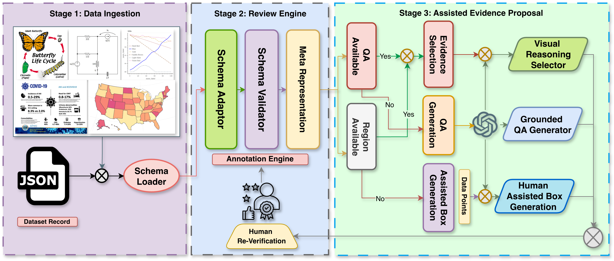

# Diagrams: A Review Framework for Reasoning-Level Attribution in Diagram QA

<p align="center">
  <a href="https://your-project-page.com">🌐 Project Page</a> •
  <a href="https://youtu.be/oli_ekuLYjo">🎬 Video</a> •
  <a href="https://github.com/your-repo">💻 Demo</a> •
</p>

---

## Overview

**Diagrams** is a dataset-agnostic browser-based annotation framework for **reasoning-level attribution** in Diagram Question Answering (Diagram QA).

Unlike traditional object-level or answer-level grounding tools, Diagrams links each QA pair to **all visual regions required to derive the answer**, enabling faithful reasoning supervision and human-in-the-loop verification.

The system:

- Loads heterogeneous Diagram QA datasets
- Normalizes them into a universal meta-schema
- Supports QA-conditioned evidence verification
- Optionally assists with AI-based box and QA generation
- Exports structured unified outputs

---

## Architecture

<p align="center">
  
</p>

Diagrams operates in three stages:

1. **Data Ingestion**
   - Upload JSON record (single object or array)
   - Auto-detect dataset format
   - Normalize into universal schema

2. **Review Engine**
   - Render image + QA
   - Draw/edit bounding boxes
   - Perform reasoning-level attribution

3. **Assisted Evidence Proposal (Optional)**
   - Generate missing bounding boxes (SAM2)
   - Generate missing QA pairs (VLM)
   - Human refinement and verification

---

## Features

### Dataset-Agnostic Normalization
- Upload arbitrary JSON records
- Detect dataset structure automatically
- Convert into unified internal representation

### Interactive Annotation
- Edit question/answer fields
- Draw and modify bounding boxes
- Support selection-based attribution
- Support proposal-based attribution

### Optional AI Assist
- Missing box generation via SAM2
- Missing QA generation via VLM
- Hugging Face API or local SAM2 backend
- Transparent AI status panel

### Export
- Unified JSON per record
- Annotated PNG export

---

## Project Structure

```
frontend/
 ├── index.html
 ├── main.js
 ├── datasetDetector.js
 ├── schemaNormalizer.js
 ├── renderer.js
 ├── annotationEngine.js
 ├── styles.css

server.py
scripts/
```

---

## Run Locally

Start the local server:

```bash
cd /Users/tampu/Documents/Diagram_Attribution/annotation_tool
python3 server.py
```

Open:

```
http://127.0.0.1:8000/frontend/
```

---

## Dataset Configuration

If your dataset images are outside default roots:

```bash
export ANNOTATION_DATA_ROOTS="/Users/tampu/Documents/Reviewed/Reviewed"
python3 server.py
```

Images referenced via `image` or `image_path` in JSON are resolved through `/api/image`.

---

## AI Assist Setup (Phase 2)

### Hugging Face Token

```bash
export HF_TOKEN="hf_..."
```

### Optional Model Overrides

```bash
export HF_SAM2_MODEL="facebook/sam2-hiera-large"
export HF_SAM2_INFERENCE_URL="https://<your-sam2-endpoint>"
export HF_VLM_MODEL="Qwen/Qwen2.5-VL-7B-Instruct"
export HF_TIMEOUT_SECONDS="90"
```

---

## Local SAM2 (Free Setup)

Install dependencies:

```bash
pip install numpy pillow torch torchvision
pip install git+https://github.com/facebookresearch/sam2.git
```

Set configuration:

```bash
export SAM2_BACKEND="local"
export SAM2_LOCAL_CONFIG="/absolute/path/to/sam2_config.yaml"
export SAM2_LOCAL_CHECKPOINT="/absolute/path/to/sam2_checkpoint.pt"
export SAM2_LOCAL_DEVICE="cuda"   # or cpu
export SAM2_LOCAL_MAX_BOXES="8"
```

Quick free setup:

```bash
./scripts/setup_local_free.sh
./scripts/run_local_free.sh
```

---

## Universal Output Format

```json
{
  "dataset_type": "...",
  "image": "...",
  "qa": {
    "question": "",
    "answer": "",
    "choices": []
  },
  "annotations": [
    {
      "id": "",
      "bbox": [0, 0, 0, 0],
      "label": "",
      "meta": {}
    }
  ],
  "metadata": {}
}
```

---
